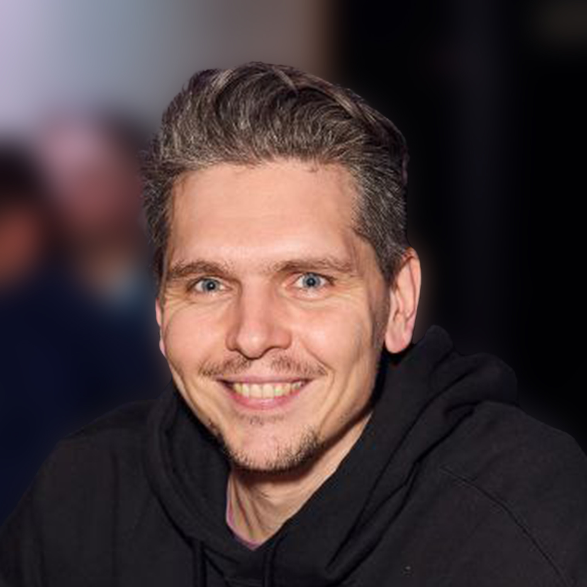

<!-- Фото-карточка -->

  

<h1 align="center">Михаил Алексеевич</h1>

  <b>Python, JS / Fullstack разработчик | Преподаватель программирования</b>  

  <a href="https://github.com/raferalston">GitHub</a> • 
  <a href="https://t.me/phukettabletop">Telegram</a>  

---

## 🧑‍💻 Обо мне

Backend-разработчик с 5+ летним опытом в классическом и современном подходе к разработке. Работал над десятками веб-приложений с нуля: от проектирования архитектуры до деплоя и поддержки. 

**Что умею сегодня:**
- Пишу надёжный и читаемый backend-код на Python с использованием Django, FastApi, DRF;
- Использую возможности prompt-инструментов (ChatGPT, Copilot, GPT API) для ускорения и усиления качества разработки;
- Опыт автоматизации бизнес-процессов через n8n: интеграции с API, Telegram-ботами, Google Sheets, создание сложных workflow с условными переходами и автозадачами;
- Знаю, как запустить проект на VPS и сделать его масштабируемым;
- Применяю async, очереди задач, мониторинг и логирование;
- Преподаю Python и JavaScript, умею объяснять сложное просто;
- Легко встраиваюсь в команду, беру ответственность за результат.
- Примеры: [портфолио](https://github.com/raferalston/portfolio)
 
---

## 📌 Ключевые компетенции

### 🖥 Backend
- Python, Django, Django REST Framework (DRF), FastApi
- Wagtail CMS (редакторский интерфейс, кастомизация)
- Celery, Redis
- PostgreSQL, SQLite
- Уверенное владение Linux, bash, системное логирование
- Развёртывание и обслуживание на VPS/VDS (nginx, supervisor, systemd)

### 🌐 Frontend
- HTML5 (вёрстка, семантическая SEO-разметка)
- CSS3 + SASS
- Vanilla JavaScript

### 🤖 Современная разработка
- AI-поддержка (GitHub Copilot, ChatGPT 4, GPT function calling)
- Автоматизация рутины через промпты
- Генерация boilerplate-кода и шаблонов через LLM

### 🔧 Инструменты
- Git, GitHub
- Docker (базовая обвязка)
- Telegram Bot API
- VSCode, PyCharm
- Figma (чтение макетов)

---

## 💼 Опыт работы

### 🎯 Фриланс / Проектная работа  
**Backend и Fullstack-разработчик**  
*2019 — настоящее время*  

- Разработка и поддержка веб-сервисов на Django и DRF  
- Реализация кастомных админок и CMS на базе Wagtail  
- Настройка продакшен-среды, деплой на VPS  
- Интеграция с Telegram API, создание бот-интерфейсов  
- SEO-оптимизация, быстрая адаптивная верстка  
- Работа с очередями задач: Celery + Redis  
- Примеры: [портфолио](https://github.com/raferalston/portfolio)

---

### 👨‍🏫 Образовательный центр **Кидкод**  
**Преподаватель Python и JavaScript**  
*2018 — 2023*  

- Проведение онлайн и оффлайн курсов по Python и JavaScript  
- Разработка методик, программ и заданий  
- Ведение интенсивов, курсов олимпиадной подготовки  
- Формирование уверенности у студентов в решении сложных задач  
- Использование визуальных и игровых подходов к обучению

---

## 🔍 Проекты и AI-применение

- **AI-усиленные генераторы Django-кода** с применением OpenAI API  
- Автоматизированные **генераторы REST API, моделей и схем**  
- Применение **LLM-помощников в работе над TDD**, генерация edge-кейсов и тестов  
- **Фреймворк для быстрого создания Telegram-ботов** с поддержкой GPT-интеграции  
- Ускорение проектирования структуры БД, роутинга и логики с помощью prompt-дизайна

---

<h2>🧠 Личные качества</h2>

<table>
  <tbody>
    <tr>
      <td>🎯 <strong>Ориентированность на результат</strong></td>
      <td>Выполняю задачи с прицелом на масштабируемость и надёжность</td>
    </tr>
    <tr>
      <td>🧩 <strong>Быстрая адаптация</strong></td>
      <td>Легко вливаюсь в команду, понимаю бизнес-контекст</td>
    </tr>
    <tr>
      <td>📈 <strong>Рост через практику</strong></td>
      <td>Постоянно осваиваю новые подходы, люблю изучать архитектуры</td>
    </tr>
    <tr>
      <td>🗣 <strong>Коммуникабельность</strong></td>
      <td>Опыт преподавания — умею слушать и объяснять</td>
    </tr>
    <tr>
      <td>🔍 <strong>Внимательность к деталям</strong></td>
      <td>Люблю чистый, поддерживаемый код и логичную архитектуру</td>
    </tr>
  </tbody>
</table>

---

## 🚀 Цели и интерес

**Ищу:** позицию Python/Django backend-разработчика в удалённой команде  
**Интересуют:** современные стек-технологии, автоматизация, AI-поддержка в разработке, продуктовые компании, ценящие качество архитектуры

---

## 📬 Контакты

- **GitHub:** [github.com/raferalston](https://github.com/raferalston)  
- **Telegram:** [@phukettabletop](https://t.me/phukettabletop)  
- **Email:** like2pwnyou@Yandex.ru
